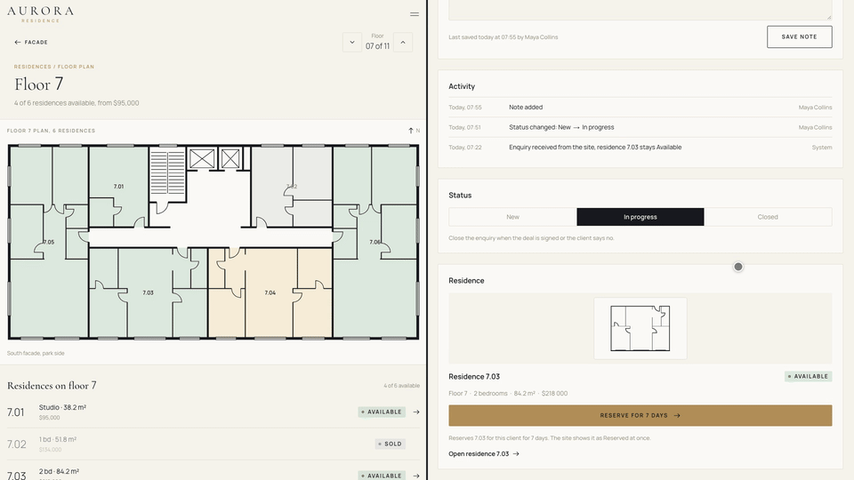
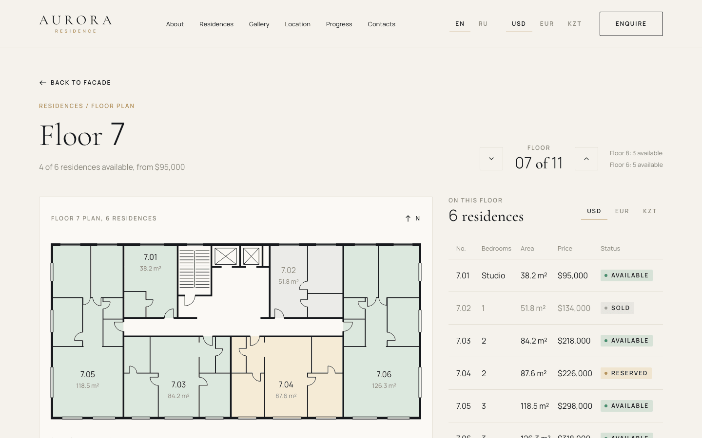
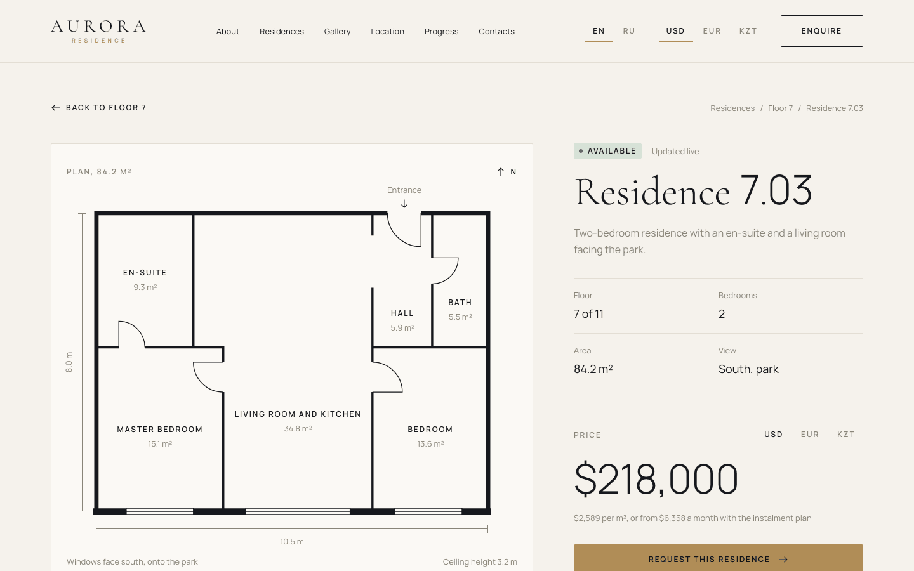
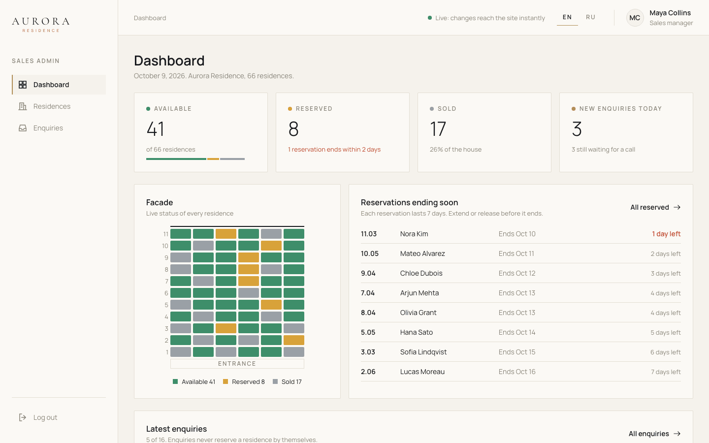

# Aurora Residence

Residential complex website with an interactive apartment selector and a sales
admin panel, built for the fictional developer Meridian Group.



Booking in the admin panel updates the site live, no reload.

## Highlights

- Pick a residence on the building facade, on a floor plan, in a floor grid or
  in a list with filters (bedrooms, price, floor). Filters live in the URL.
- Live status: when a manager reserves or sells a residence in the admin panel,
  the facade, floor plan and residence page update without a reload
  (WebSocket).
- English and Russian, prices in USD, EUR or KZT.
- Instalment calculator on every residence page (0%, 10-70% down payment,
  6-60 months).
- Admin panel for the sales team: dashboard, residences, enquiries and 7-day
  reservations that are released automatically. Works on a phone.
- Lighthouse mobile performance 93-94, no layout shift.

## Screenshots

Home page


Facade selector


Floor plan



Residence page



Admin dashboard



Mobile


## Tech stack

- Web: Next.js 16 (App Router), TypeScript, Tailwind CSS v4
- API: NestJS 11, TypeScript, Prisma 7
- Database: PostgreSQL 16
- Runtime: Docker Compose, nginx as the single entry point

## Architecture

```
apps/
  api/      NestJS API, Prisma schema, migrations and the demo seed
  web/      Next.js site and admin panel
nginx/      reverse proxy config
```

- nginx is the only public service (port 80): `/` goes to the web app, `/api`
  to the API, `/socket` to the API with WebSocket upgrade.
- The web app renders pages on the server and reads data from the API over the
  internal Compose network.
- The API owns all data in PostgreSQL. Every status change is written to the
  residence history and, after the transaction commits, broadcast to open pages
  through `/socket`.
- A job in the API releases expired reservations every minute.
- Admin auth: 15-minute JWT access token, refresh token in an httpOnly cookie,
  sessions stored in the database, sign-in rate limits by email and by IP.

## Run locally

Requirements: Docker with Docker Compose.

```bash
cp .env.example .env
# fill in every value, secrets can be generated with: openssl rand -hex 48
docker compose up -d --build
```

Open http://localhost (use `localhost`, not `127.0.0.1`: the live socket only
accepts origins from `WS_ALLOWED_ORIGINS`). API health check:
http://localhost/api/health.

On start the API applies migrations and seeds the demo data if the database is
empty.

Demo login at http://localhost/admin:

- Email: `maya.collins@aurora-residence.com`
- Password: the `ADMIN_PASSWORD` value from your `.env`

Reset demo data (dates are relative to the day of seeding):

```bash
docker compose exec api node dist/prisma/seed.js
```

### Development without Docker for the apps

Requirements: Node.js 20.19+ and pnpm 10 (`corepack enable`).

```bash
pnpm install

# PostgreSQL from Compose on localhost:5432 (POSTGRES_DEV_PORT in .env to change)
docker compose -f docker-compose.yml -f docker-compose.dev.yml up -d postgres

# API env: same values as .env, but DATABASE_URL points to localhost
cp .env apps/api/.env

pnpm --filter api exec prisma migrate deploy
pnpm --filter api db:seed
pnpm --filter api start:dev    # http://localhost:4000/api/health
pnpm --filter web dev          # http://localhost:3000
```

## Tests

```bash
pnpm lint
pnpm typecheck
pnpm --filter web test
pnpm --filter api test
```

`pnpm --filter api test` needs only Docker: it starts a throwaway PostgreSQL
from `docker-compose.test.yml` on `127.0.0.1:5443`, runs the unit and
end-to-end tests and removes the database. It does not touch the main stack.
If the port is taken: `TEST_POSTGRES_PORT=5444 pnpm --filter api test`.

## Deploy

HTTPS is required on a public server: never publish the admin panel over plain
http. The stack runs on any VPS with Docker. TLS ends at the nginx container,
the API and the web app stay on the internal Compose network.

`HTTPS_ENABLED` in `.env` switches on the `Secure` flag on the refresh cookie
and the HSTS header. Keep it `false` only for http://localhost.

1. Point the domain (for example `aurora.example.com`) to the server and open
   ports 80 and 443.
2. Get a Let's Encrypt certificate with certbot on the host while port 80 is
   free:

   ```bash
   docker compose stop nginx
   sudo certbot certonly --standalone -d aurora.example.com
   ```

3. Next to `docker-compose.yml` create `docker-compose.https.yml` and
   `nginx/https.conf` (they are server specific and not in the repository):

   ```yaml
   services:
     nginx:
       ports:
         - "80:80"
         - "443:443"
       volumes:
         - ./nginx/https.conf:/etc/nginx/conf.d/default.conf:ro
         - /etc/letsencrypt:/etc/letsencrypt:ro
   ```

   `nginx/https.conf` is `nginx/default.conf` with these changes: the port 80
   server only redirects, and the existing `location` blocks and `error_page`
   move to a 443 server.

   ```nginx
   server {
       listen 80;
       server_name aurora.example.com;
       return 301 https://$host$request_uri;
   }

   server {
       listen 443 ssl;
       http2 on;
       server_name aurora.example.com;
       ssl_certificate     /etc/letsencrypt/live/aurora.example.com/fullchain.pem;
       ssl_certificate_key /etc/letsencrypt/live/aurora.example.com/privkey.pem;
       ssl_protocols TLSv1.2 TLSv1.3;
       # proxy settings and location blocks from nginx/default.conf
   }
   ```

4. In `.env` set `HTTPS_ENABLED=true`, `WS_ALLOWED_ORIGINS` to the site address
   (for example `https://aurora.example.com`) and strong values for every
   secret, then start:

   ```bash
   docker compose -f docker-compose.yml -f docker-compose.https.yml up -d --build
   ```

5. Check: `curl -I http://aurora.example.com` answers 301 to https, and
   `curl -I https://aurora.example.com/api/health` has a
   `Strict-Transport-Security` header. The refresh cookie must have `Secure`.
6. Renewal: certificates live 90 days. Add a cron job on the host:

   ```bash
   certbot renew --quiet \
     --pre-hook "docker compose -f /path/to/docker-compose.yml stop nginx" \
     --post-hook "docker compose -f /path/to/docker-compose.yml -f /path/to/docker-compose.https.yml up -d nginx"
   ```

The API trusts exactly one proxy hop (nginx) for the client IP used by the
sign-in limits. If another proxy or a CDN is put in front of nginx, change
`trust proxy` in `apps/api/src/app.setup.ts` to match, otherwise all visitors
share one IP limit.

## Note

All names, brands, people and data in this project are fictional.
